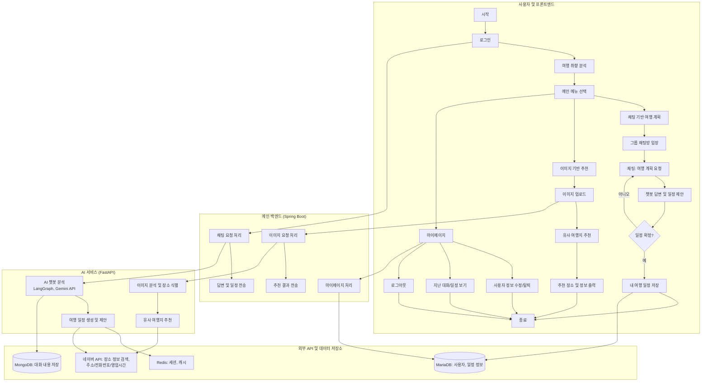
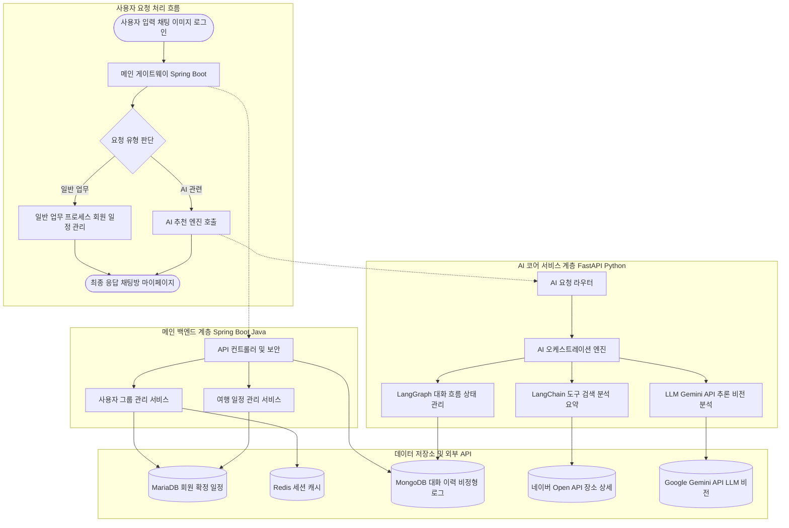
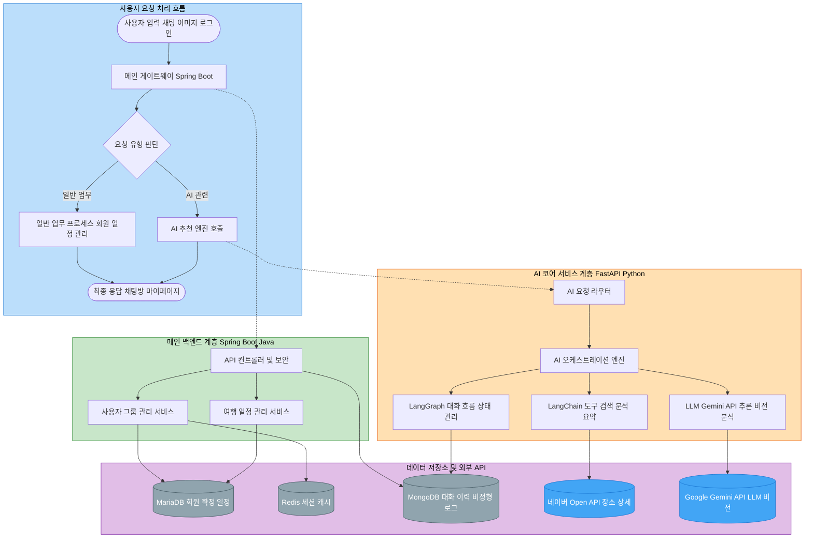
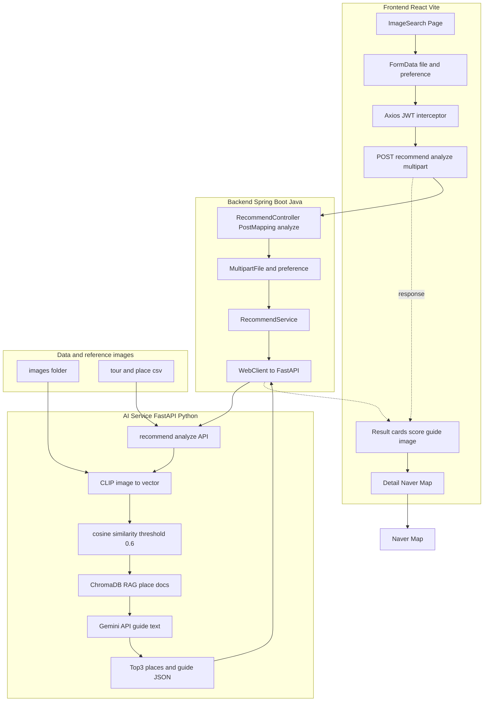
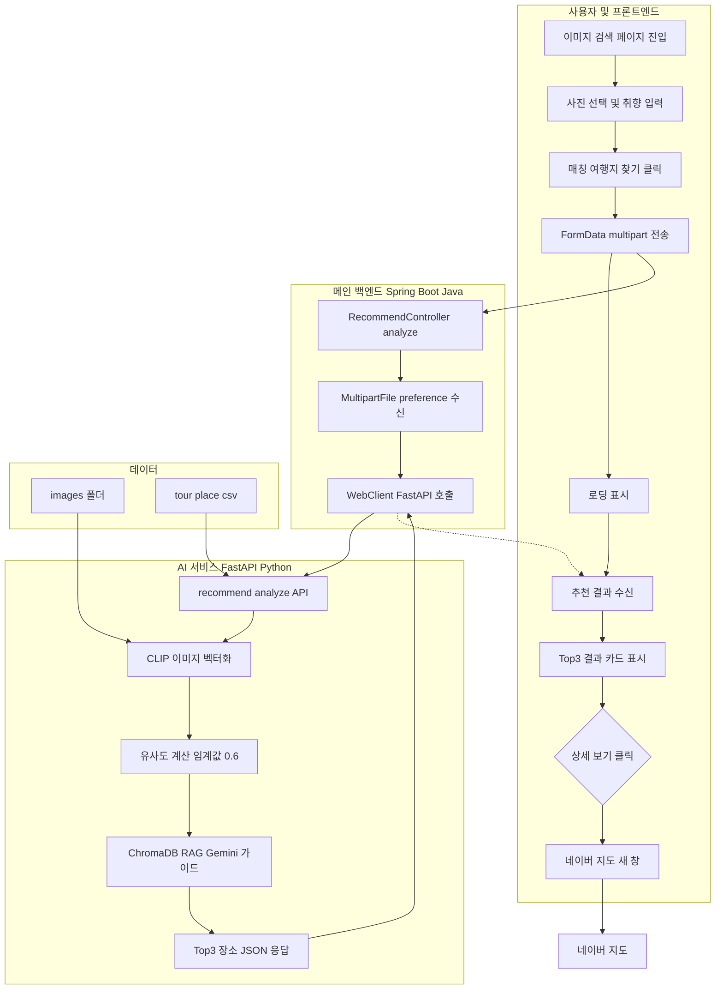

# AI 기반 여행지 추천 시스템 — 단위 테스트 계획서 & 아키텍처

---

## 1. 단위 테스트 계획서 (표)

아래 내용을 반영한 단위 테스트 계획을 표 형태로 정리했다.

| 번호 | 테스트 대상 (모듈/기능) | 테스트 유형 | 테스트 내용 | 입력/조건 | 예상 결과 | 비고 |
|------|--------------------------|-------------|-------------|-----------|-----------|------|
| 1 | **로그인** | 기능 | 사용자 로그인 시 인증 처리 | 유효한 계정 정보 | 로그인 성공, 세션/토큰 발급 | Spring Boot, Redis(세션) |
| 2 | **로그인** | 예외 | 잘못된 계정으로 로그인 | 잘못된 ID/비밀번호 | 로그인 실패, 적절한 에러 메시지 | |
| 3 | **여행 취향 분석** | 기능 | 로그인 후 사용자 선호도 기반 취향 분석 | 선호도 입력/선택 | 취향 분석 결과 반환 | FastAPI / 분석 로직 |
| 4 | **챗봇 (여행 일정)** | 기능 | 채팅 입력 시 LLM(Gemini API)으로 답변 생성 | 채팅 메시지 (여행 계획 요청) | 챗봇 답변 및 일정 제안 | LangChain, LangGraph, Gemini API |
| 5 | **챗봇 (여행 일정)** | 기능 | 대화 흐름·상태 관리 | 연속 대화 입력 | 문맥 유지된 답변, 일정 생성·제안 | LangGraph 상태 관리 |
| 6 | **이미지 기반 추천** | 기능 | 이미지 업로드 시 유사 여행지 추천 | 이미지 파일 업로드 | 유사 장소 목록 및 정보 반환 | FastAPI, 이미지 분석·유사도 |
| 7 | **이미지 기반 추천** | 예외 | 지원하지 않는 형식 또는 빈 파일 | 잘못된/빈 이미지 | 에러 처리 또는 안내 메시지 | |
| 8 | **네이버 API 연동** | 기능 | 장소 상세 정보 조회 (주소, 전화번호, 영업시간) | 장소 식별자 또는 검색어 | 정확한 주소·전화번호·영업시간 반환 | Naver API |
| 9 | **네이버 API 연동** | 예외 | API 실패 또는 미존재 장소 | 잘못된 요청/장소 | 에러 처리, fallback 또는 안내 | |
| 10 | **마이페이지 — 사용자 정보** | 기능 | 사용자 정보 조회·수정 | 로그인 사용자 | 정보 조회/수정 성공 | Spring Boot, MariaDB |
| 11 | **마이페이지 — 탈퇴/로그아웃** | 기능 | 회원 탈퇴, 로그아웃 | 탈퇴/로그아웃 요청 | 세션 종료, 탈퇴 처리 반영 | Redis 세션, MariaDB |
| 12 | **대화 내용 저장** | 기능 | 챗봇과의 대화 저장 | 저장 요청 (대화 ID 등) | 대화 이력 저장 후 목록 반영 | MongoDB (대화 이력) |
| 13 | **대화 내용 저장** | 기능 | 저장된 대화 목록 조회 | 로그인 사용자 | 해당 사용자 대화 목록 반환 | MongoDB |
| 14 | **메인 게이트웨이 (Spring Boot)** | 통합 | 요청 유형 분기 (일반 업무 vs AI 추천) | 채팅/이미지/로그인 등 | 적절한 백엔드·AI 서비스로 라우팅 | Spring Boot |
| 15 | **AI 서비스 (FastAPI)** | 통합 | AI 요청 라우팅 및 오케스트레이션 | AI 관련 요청 | LangGraph/LangChain·Gemini 호출, 결과 반환 | FastAPI, LangChain, LangGraph |
| 16 | **데이터 저장소** | 연동 | MariaDB 회원·일정 정보 읽기/쓰기 | CRUD 요청 | 정상 저장·조회 | MariaDB |
| 17 | **데이터 저장소** | 연동 | Redis 세션·캐시 읽기/쓰기 | 세션/캐시 키 | 정상 저장·조회·만료 | Redis |
| 18 | **데이터 저장소** | 연동 | MongoDB 대화 이력 저장·조회 | 대화 저장/조회 요청 | 정상 저장·조회 | MongoDB |

---

## 2. 전체 업무흐름도 (Mermaid)

---

## 3. 시스템 구조도 — 기술 스택 활용 (Mermaid)

아래 블록을 **Mermaid Live Editor**에 붙여넣으면 1.png와 비슷한 레이어 색상으로 렌더됩니다.

**1.png처럼 레이어 색상 넣은 버전 (Mermaid Live용):**  
아래 코드 전체를 **Mermaid Live Editor**에 붙여넣으면, 상단 연한 파랑·메인 백엔드 연한 초록·AI 코어 연한 주황·데이터 계층 연한 보라로 나옵니다. DB는 회색, 외부 API는 파란 계열로 맞춰 두었습니다.

---

## 4. 기술 스택 요약 표

| 구분 | 기술 스택 | 용도 |
|------|-----------|------|
| 메인 백엔드 | Spring Boot, Java | API 게이트웨이, 회원/일정 관리, 보안 |
| AI 서비스 | FastAPI, Python | AI 요청 라우팅, 챗봇·이미지 추천 |
| AI/LLM | LangChain, LangGraph, Gemini API | 대화 흐름, 일정 생성, 이미지 분석·유사 추천 |
| DB | MariaDB | 회원, 확정 일정 정보 |
| 캐시/세션 | Redis | 세션, 캐시 |
| 대화/로그 | MongoDB | 대화 이력, 비정형 로그 |
| 외부 API | 네이버 Open API | 장소 주소, 전화번호, 영업시간 등 상세 정보 |

---

## 5. 이미지 업로드 부분 풀스택 — 시스템 구조도 (기술 스택 활용)

본인 담당 구간(이미지 업로드·추천 결과 표시)만 보이는 구조도다.

**흐름 요약:**  
사용자(React) → FormData로 이미지·취향 전송 → Spring Boot가 Multipart 수신 후 WebClient로 FastAPI 호출 → FastAPI에서 CLIP 벡터화·유사도·ChromaDB RAG·Gemini 가이드 → 응답을 Spring 경유로 프론트에 전달 → 결과 카드 표시, 상세 보기 시 네이버 지도 오픈.

**기술 스택 (이미지 업로드 풀스택):**

| 계층 | 기술 | 역할 |
|------|------|------|
| 프론트 | React, Vite, Axios | 업로드 UI, FormData, multipart 전송, JWT, 결과 카드, 네이버 지도 링크 |
| 백엔드 | Spring Boot, Java, WebClient | `/api/v1/recommend/analyze`, MultipartFile, FastAPI 프록시 |
| AI | FastAPI, Python, CLIP(sentence-transformers), ChromaDB, Gemini | 이미지 벡터화, 유사도, RAG, 가이드 생성 |
| 데이터 | images 폴더, tour.csv, place.csv | 기준 이미지, 장소–이미지–메타 매핑 |
| 외부 | 네이버 지도 | 상세 보기 링크 |

---

## 6. 이미지 업로드 부분 전용 (담당 구간)

아래는 **이미지 업로드·유사 여행지 추천** 담당 구간만 정리한 단위 테스트 계획서(표), 전체 업무흐름도, 시스템 구조도다.

### 6.1 단위 테스트 계획서 — 이미지 부분만 (표)

| 번호 | 테스트 대상 (모듈/기능) | 테스트 유형 | 테스트 내용 | 입력/조건 | 예상 결과 | 비고 |
|------|--------------------------|-------------|-------------|-----------|-----------|------|
| 1 | **이미지 검색 페이지 (프론트)** | 기능 | 사진 선택 및 미리보기 | 이미지 파일 선택 | 선택된 파일 미리보기 표시 | React, input file, URL.createObjectURL |
| 2 | **이미지 검색 페이지 (프론트)** | 기능 | 취향 입력란 입력 | 텍스트 입력 (예: 가족, 맛집) | 입력값 유지, FormData에 포함 | preference |
| 3 | **이미지 검색 페이지 (프론트)** | 기능 | FormData로 이미지·취향 전송 | 파일 + preference, POST multipart | Spring API 호출, JWT 자동 부착 | Axios, multipart/form-data |
| 4 | **이미지 검색 페이지 (프론트)** | 기능 | 로딩 중 UI | 분석 요청 후 | 로딩 오버레이 표시 | isAnalyzing |
| 5 | **이미지 검색 페이지 (프론트)** | 기능 | 추천 결과 카드 표시 | API 성공 응답 (results 배열) | Top3 카드: 장소명, 유사도%, 가이드, 이미지 | |
| 6 | **이미지 검색 페이지 (프론트)** | 기능 | 상세 보기 → 네이버 지도 | 카드 상세 보기 클릭 | 네이버 지도 검색 새 창 오픈 | window.open |
| 7 | **이미지 검색 페이지 (프론트)** | 예외 | 매칭 없음 / API 실패 | 유사도 0.6 미만 또는 서버 오류 | 안내 메시지 또는 alert | |
| 8 | **Recommend API (Spring)** | 기능 | MultipartFile·preference 수신 | POST /api/v1/recommend/analyze | FastAPI로 전달, 응답 그대로 반환 | RecommendController, WebClient |
| 9 | **Recommend API (FastAPI)** | 기능 | 이미지 벡터화 및 유사도 | 이미지 바이트, 기준 이미지 벡터 | CLIP 인코딩, 코사인 유사도 Top3, 임계값 0.6 | CLIP, sentence-transformers |
| 10 | **Recommend API (FastAPI)** | 기능 | 장소 정보 조회 | 파일명 또는 장소 ID | tour·place CSV 기반 장소명, 주소 반환 | _get_place_info |
| 11 | **Recommend API (FastAPI)** | 기능 | 가이드 문장 생성 | Top1 장소, 취향, Chroma RAG 결과 | Gemini API로 가이드 텍스트 생성 | ChromaDB, Gemini |
| 12 | **데이터·기준 이미지** | 연동 | 기준 이미지 목록 및 임베딩 | 서버 기동 시 | images 폴더 목록, 사전 임베딩 로드 | _precompute_db_embeddings |
| 13 | **네이버 지도 연동** | 기능 | 상세 보기 링크 | 장소명·주소 | 네이버 지도 검색 URL 생성 및 오픈 | 프론트에서 URL 조합 |

### 6.2 전체 업무흐름도 — 이미지 부분만 (Mermaid)

### 6.3 시스템 구조도 (기술 스택) — 이미지 부분만 (Mermaid)

**이미지 부분 기술 스택 요약:**  
React, Vite, Axios | Spring Boot, Java, WebClient | FastAPI, Python, CLIP(sentence-transformers), ChromaDB, Gemini API | images 폴더, tour.csv, place.csv | 네이버 지도(상세 보기).

---

위 단위 테스트 계획서는 첨부해 주신 계획서와 시스템 설명을 바탕으로 표로 재구성했고, Mermaid로 전체 업무흐름도와 시스템 구조도(기술 스택 반영)를 작성해 두었습니다. **섹션 6**은 담당 구간인 이미지 업로드 부분만 표·업무흐름도·시스템 구조도로 정리한 내용입니다.
