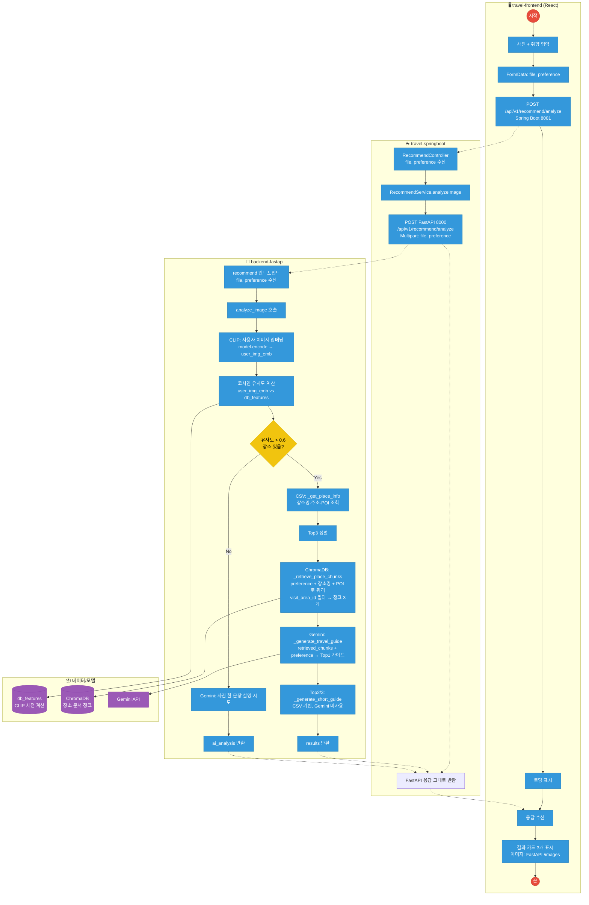
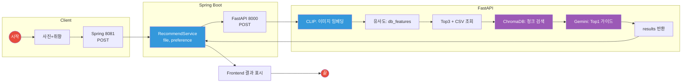

# 이미지 추천 로직 - 업무 흐름도 (Mermaid)

업무 흐름도 스타일: **빨간 원 = 시작/종료**, **파란 사각형 = 프로세스**, **마름모 = 판단**.

---

## Mermaid Flowchart 코드

---

## 간단 버전 (Spring Boot ↔ FastAPI, CLIP·ChromaDB 위치만)

---

## 요소 설명

| 요소 | 의미 |
|------|------|
| **빨간 원** | 시작 / 종료 |
| **파란 사각형** | 프로세스 (처리 단계) |
| **노란 마름모** | 판단 (유사 장소 있음?) |
| **보라색** | 데이터/외부 (CLIP db_features, ChromaDB, Gemini) |
| **Spring Boot** | file·preference 수신 → FastAPI로 그대로 전달 → 응답 그대로 프론트로 전달 |
| **CLIP** | 사용자 이미지 → 벡터화, DB 이미지 벡터(db_features)와 코사인 유사도 → Top3 |
| **ChromaDB** | preference + 장소명 + POI로 쿼리 → 해당 장소(visit_area_id) 청크 검색 → RAG 근거 |
| **Gemini** | Chroma에서 가져온 청크 + preference로 Top1 가이드 생성 |

위 코드를 [Mermaid Live Editor](https://mermaid.live) 또는 VS Code Mermaid 확장에서 렌더링하면 됩니다.
