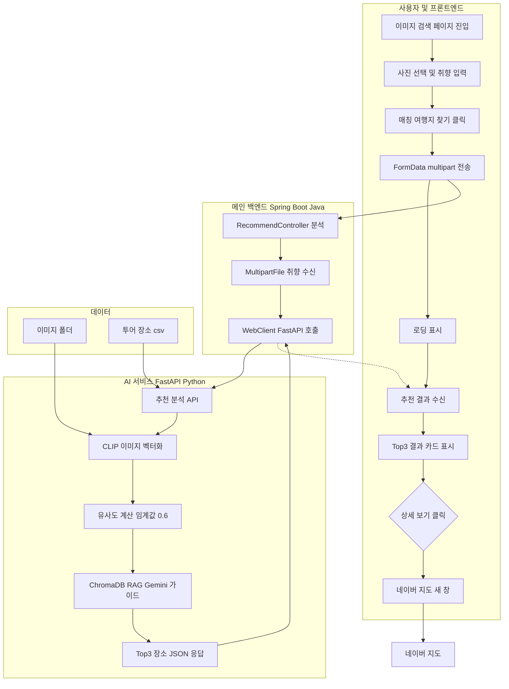
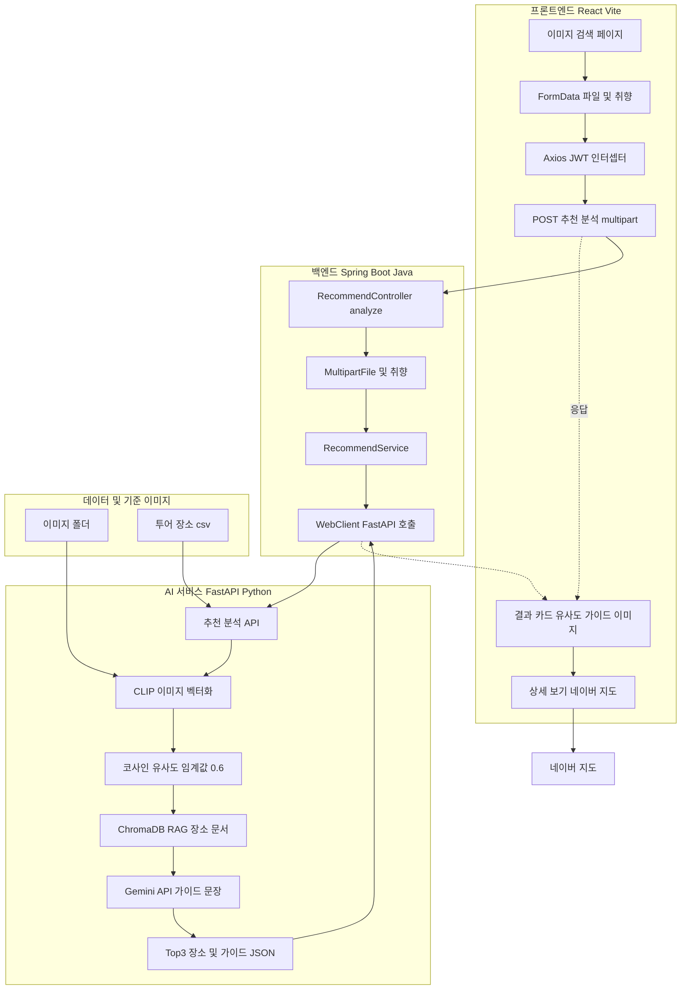

# 이미지 업로드 부분 — 단위 테스트 · 업무흐름도 · 시스템 구조도 (복사용)

---

## 1. 단위 테스트 계획서 (표)

| 번호 | 테스트 대상 (모듈/기능) | 테스트 유형 | 테스트 내용 | 입력/조건 | 예상 결과 | 비고 |
|------|--------------------------|-------------|-------------|-----------|-----------|------|
| 1 | 이미지 검색 페이지 (프론트) | 기능 | 사진 선택 및 미리보기 | 이미지 파일 선택 | 선택된 파일 미리보기 표시 | React, URL.createObjectURL |
| 2 | 이미지 검색 페이지 (프론트) | 기능 | 취향 입력란 입력 | 텍스트 입력 (예: 가족, 맛집) | 입력값 유지, FormData에 포함 | preference |
| 3 | 이미지 검색 페이지 (프론트) | 기능 | FormData로 이미지·취향 전송 | 파일 + preference, POST multipart | Spring API 호출, JWT 자동 부착 | Axios, multipart/form-data |
| 4 | 이미지 검색 페이지 (프론트) | 기능 | 로딩 중 UI | 분석 요청 후 | 로딩 오버레이 표시 | isAnalyzing |
| 5 | 이미지 검색 페이지 (프론트) | 기능 | 추천 결과 카드 표시 | API 성공 응답 (results 배열) | Top3 카드: 장소명, 유사도%, 가이드, 이미지 | |
| 6 | 이미지 검색 페이지 (프론트) | 기능 | 상세 보기 → 네이버 지도 | 카드 상세 보기 클릭 | 네이버 지도 검색 새 창 오픈 | window.open |
| 7 | 이미지 검색 페이지 (프론트) | 예외 | 매칭 없음 / API 실패 | 유사도 0.6 미만 또는 서버 오류 | 안내 메시지 또는 alert | |
| 8 | Recommend API (Spring) | 기능 | MultipartFile·preference 수신 | POST /api/v1/recommend/analyze | FastAPI로 전달, 응답 그대로 반환 | RecommendController, WebClient |
| 9 | Recommend API (FastAPI) | 기능 | 이미지 벡터화 및 유사도 | 이미지 바이트, 기준 이미지 벡터 | CLIP 인코딩, 코사인 유사도 Top3, 임계값 0.6 | CLIP, sentence-transformers |
| 10 | Recommend API (FastAPI) | 기능 | 장소 정보 조회 | 파일명 또는 장소 ID | tour·place CSV 기반 장소명, 주소 반환 | _get_place_info |
| 11 | Recommend API (FastAPI) | 기능 | 가이드 문장 생성 | Top1 장소, 취향, Chroma RAG 결과 | Gemini API로 가이드 텍스트 생성 | ChromaDB, Gemini |
| 12 | 데이터·기준 이미지 | 연동 | 기준 이미지 목록 및 임베딩 | 서버 기동 시 | images 폴더 목록, 사전 임베딩 로드 | _precompute_db_embeddings |
| 13 | 네이버 지도 연동 | 기능 | 상세 보기 링크 | 장소명·주소 | 네이버 지도 검색 URL 생성 및 오픈 | 프론트에서 URL 조합 |

---

## 2. 전체 업무흐름도 (Mermaid) — 복사해서 mermaid.live 등에 붙여넣기

---

## 3. 시스템 구조도 기술 스택 (Mermaid) — 복사해서 mermaid.live 등에 붙여넣기

---

- **표**: PPT나 문서에 그대로 붙여넣거나 수정해서 사용하면 됩니다.
- **Mermaid**: https://mermaid.live 에서 코드만 붙여넣으면 다이어그램으로 보이고, PNG·SVG로 내보내기 할 수 있습니다.
